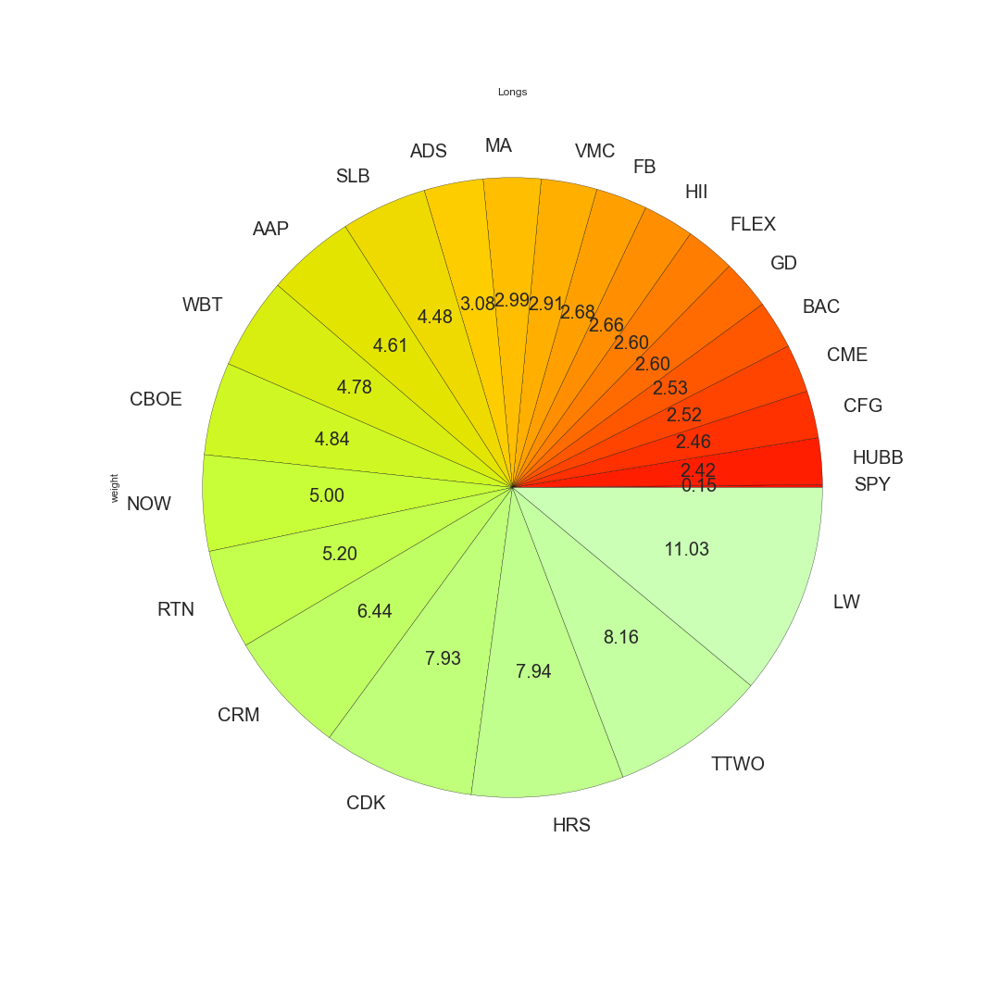
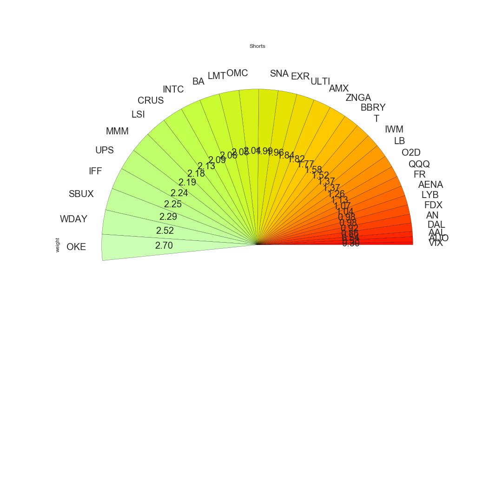
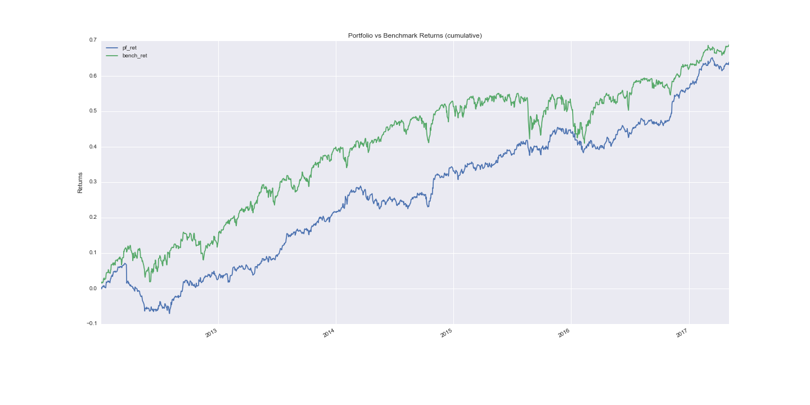
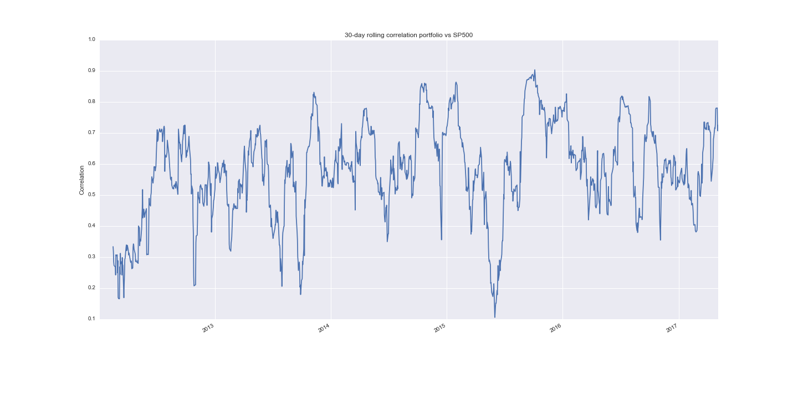
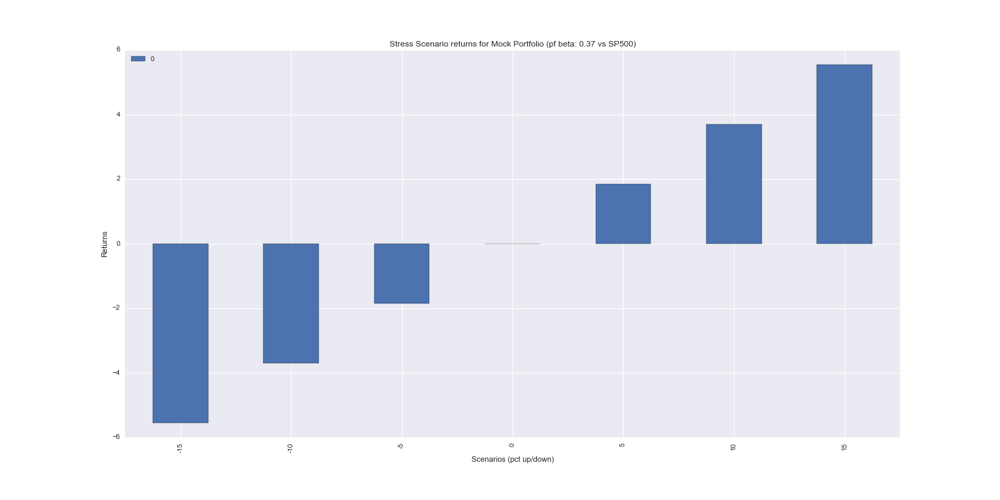

# eq-stress-test
Long/Short Equity Portfolio Stress Test

This project will read the weights file for constituents (.csv), download historical prices (store them in a [SQLAlchemy Core](http://docs.sqlalchemy.org/en/latest/core/engines.html) powered db) and calculate portfolio and benchmark returns.

Once daily return series are obtained, a [portfolio beta](http://www.investopedia.com/terms/b/beta.asp) is calculated and used for stress testing.

Results are currently outputted to a styled web page which can also be converted to a pdf (via wkhtmltopdf).

-----

#### Dependencies:

Visuals generated as part of the report depend on matplotlib. Getting matplotlib working in virtual environments is tricky see [Working with Matplotlib in Virtual Environments](http://matplotlib.org/faq/virtualenv_faq.html).

Therefore we are just going to use conda to create the environment.

`conda create -n eq-stress python=3.5.2 matplotlib`

Then install the remaining requirements

`pip install -r requirements.txt`

For further dependency issues please see: http://stackoverflow.com/questions/35472693/how-to-get-matplotlib-pyplot-working-in-virtual-environment-on-osx

_in case matplotlib is still throwing errors, it is suggested to install requirements in an environment where matplotlib is functioning properly_

Also if it is desired to output the html into a pdf, we need to download [wkhtmltopdf](https://wkhtmltopdf.org/downloads.html)
 
----

#### How to run

`python run_stress_test.py --weights_file your_weights_file.csv`

Your `weights.csv` should look like this

```
ticker,weight
ticker1,.8
ticker2,.2
```

if pdf version of the report is needed run `wkhtmltopdf --orientation Portrait stress_test_rpt_output.html ~/<desired_path>/a.pdf`

----

Here's how the visuals would look like:
 
 ##### Positions Breakdown (Longs)
 
 
 ##### Positions Breakdown (Shorts)
 
 
 ##### Cumulative Returns
 
 
 ##### Rolling Correlations
 
 
 ##### Scenario Returns
 